# 智能穿搭助手用户使用手册

更新时间：2026-05-29

本文档面向最终用户和运营同学，用来说明智能穿搭助手从登录到各功能使用的完整流程。每个核心功能都配有截图，截图素材位于 `docs/_tutorial_assets/`，可直接用于官网、客服话术、培训资料和用户帮助中心。

## 1. 启动与进入系统

### 1.1 启动服务

使用前需要确认后端和前端都已启动：

- 后端默认地址：`http://127.0.0.1:8010`
- Flutter Web 默认地址：以本地启动输出为准，常见为 `http://127.0.0.1:8081`

如果页面打不开，优先检查后端端口、前端端口和网络连接。

### 1.2 登录 / 注册

新用户先点击“注册”，填写用户名、邮箱、手机号或密码等信息；已有账号直接在“登录”页输入账号和密码。

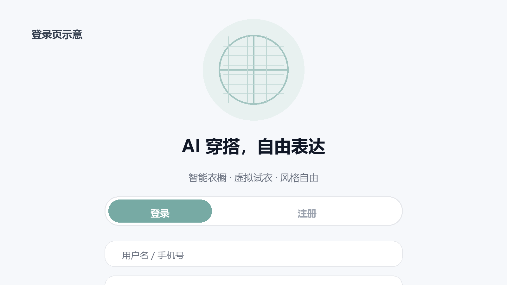

操作结果：

- 登录成功后进入首页或新手引导页。
- 登录失败时，根据页面提示检查账号、密码或后端服务状态。

## 2. 新手引导

首次登录后会进入新手引导。用户可以了解智能衣橱、个性化推荐和虚拟试衣等能力，也可以点击“跳过”直接进入主界面。

建议用户完成引导后，先去“设置”补充身高、体型、肤色和风格偏好，这会提升后续推荐准确度。

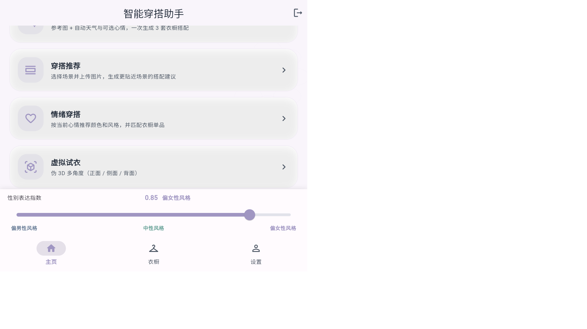

## 3. 首页

首页是日常入口，会展示城市、天气、温度和今日推荐卡片。用户可以先看今日推荐，再进入具体功能。

常用入口：

- “一键生成”快速生成当天穿搭。
- “查看详情”进入上一次推荐结果。
- 功能卡片进入衣橱、智能穿搭、情绪穿搭、虚拟试衣、相似度分析、适合度分析、体型洞察等页面。

## 4. 功能总览

建议用户按以下顺序使用：

1. 登录或注册。
2. 完成新手引导。
3. 补充个人资料和风格偏好。
4. 上传衣物到衣橱。
5. 使用智能穿搭生成推荐。
6. 用情绪穿搭、适合度分析、相似度分析做补充判断。
7. 需要看上身效果时使用虚拟试衣。
8. 有复杂需求时使用 AI Agent 对话。

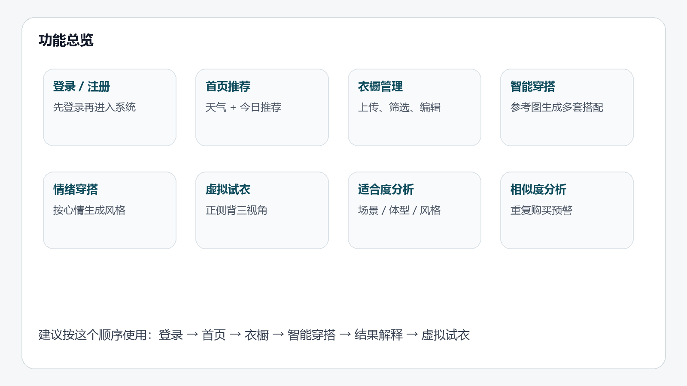

## 5. 衣橱管理

衣橱是所有推荐功能的数据基础。用户上传的衣物越完整，智能推荐越准确。

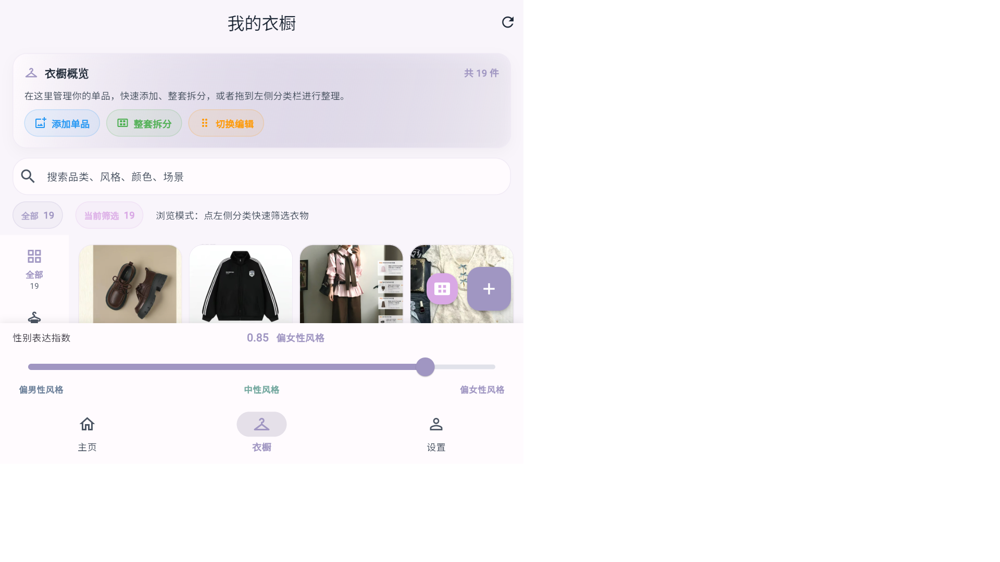

使用步骤：

1. 点击底部“衣橱”。
2. 点击“添加单品”或上传入口。
3. 选择清晰的衣物图片，建议单品完整、背景简洁。
4. 补充类别、颜色、季节、风格标签。
5. 使用搜索或筛选检查衣橱内容。

用户会获得：

- 可管理的衣物列表。
- 后续智能穿搭、相似度分析、情绪穿搭可调用的衣橱数据。

## 6. 智能穿搭

智能穿搭用于根据参考图、天气、场景和衣橱内容生成多套搭配方案。

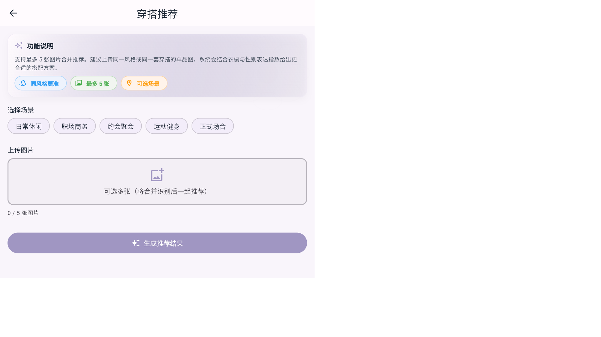

使用步骤：

1. 从首页点击“智能穿搭”或“一键生成”。
2. 选择场景，例如通勤、休闲、约会、运动。
3. 上传 1 到 5 张参考图，或从衣橱选择图片。
4. 确认天气、城市、心情等信息。
5. 点击生成。

结果说明：

- 系统会返回搭配方案、评分和理由。
- 评分可帮助用户快速判断是否适合今天。
- 推荐理由通常包含颜色协调、场景匹配、层次搭配等解释。

## 7. 搭配推荐 / 风格打分

搭配推荐偏向“上衣 + 下装 + 场景”的结构化推荐，也可以用于简单的风格评分。

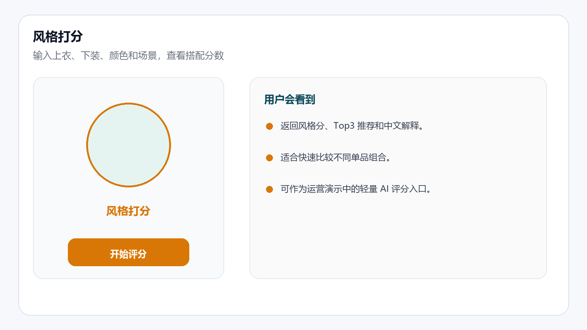

使用步骤：

1. 进入“搭配推荐”。
2. 输入或选择上衣、下装、颜色、季节和场景。
3. 点击生成或评分。
4. 查看 Top 推荐、风格分和中文解释。

适合场景：

- 用户已经有明确单品，想知道怎么搭。
- 用户想比较不同上衣和下装组合。
- 运营演示 AI 打分能力。

## 8. 情绪穿搭

情绪穿搭根据用户当前心情生成颜色方向、风格关键词和衣橱匹配建议。

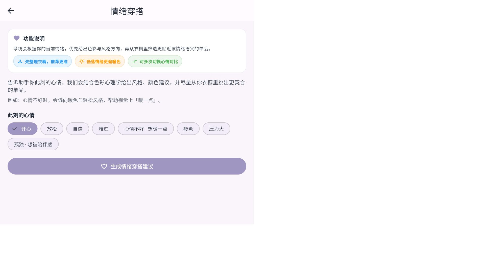

使用步骤：

1. 从首页进入“情绪穿搭”。
2. 选择当前心情，例如放松、元气、安静、正式、压力大。
3. 点击生成情绪穿搭建议。
4. 查看推荐色系、风格方向和匹配单品。

适合场景：

- 不知道今天想穿什么。
- 想按心情而不是天气来选衣服。
- 想生成更有情绪价值的穿搭文案。

## 9. 虚拟试衣

虚拟试衣用于把衣服图和人物图合成，预览上身效果。

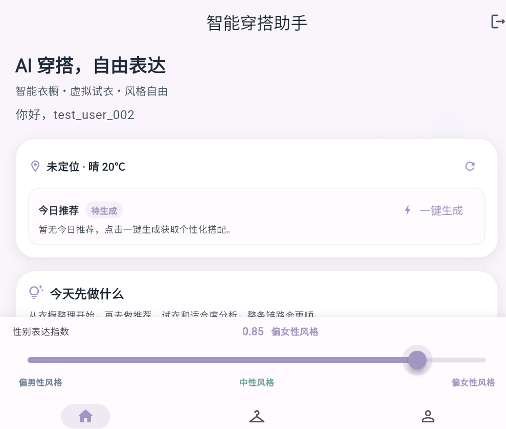

使用步骤：

1. 进入“虚拟试衣”。
2. 上传衣服图，建议使用无模特、背景干净的商品图。
3. 上传人物正面照，建议全身清晰、光线充足。
4. 选择衣物类型或模式。
5. 点击生成，等待结果图。
6. 生成成功后，移动端可点击“保存到相册”；Web 端可点击“打开试衣图”在新标签页查看或下载。

注意事项：

- 衣服图如果包含模特，可能导致重影或接口拒绝。
- 人物图越清晰，试衣边缘和比例越稳定。
- 高质量模式可能耗时更久。
- 从 Look 相似度结果进入试衣时，系统会自动带入候选衣物，只需要再上传人物正面照。

## 10. 相似度分析

相似度分析用于判断一件新衣服和衣橱里的已有衣物是否相似，帮助用户避免重复购买；也可以上传整身 Look，让系统拆分上装、下装等部件后分别匹配衣橱。

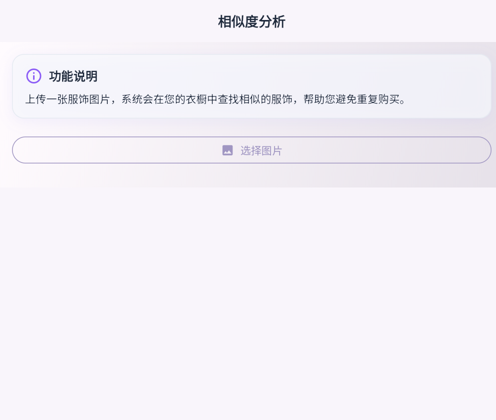

使用步骤：

1. 进入“相似度分析”。
2. 选择“单品”或“Look”模式。
3. 单品模式上传计划购买或刚拍摄的衣服图片；Look 模式上传整身穿搭图片。
4. 点击分析。
5. 单品模式查看相似候选、相似度分数和重复购买提示；Look 模式查看整体匹配、部件匹配、缺失品类和可试穿候选。

判断建议：

- 相似度高：说明衣橱里已有接近款，可谨慎购买。
- 相似度中：可以比较颜色、材质、版型后再决定。
- 相似度低：说明衣橱中替代品较少。
- Look 模式中的候选衣物可继续带入虚拟试衣，用于快速验证上身效果。

## 11. 适合度分析

适合度分析用于判断某件衣物是否适合用户的场景、体型和个人风格。

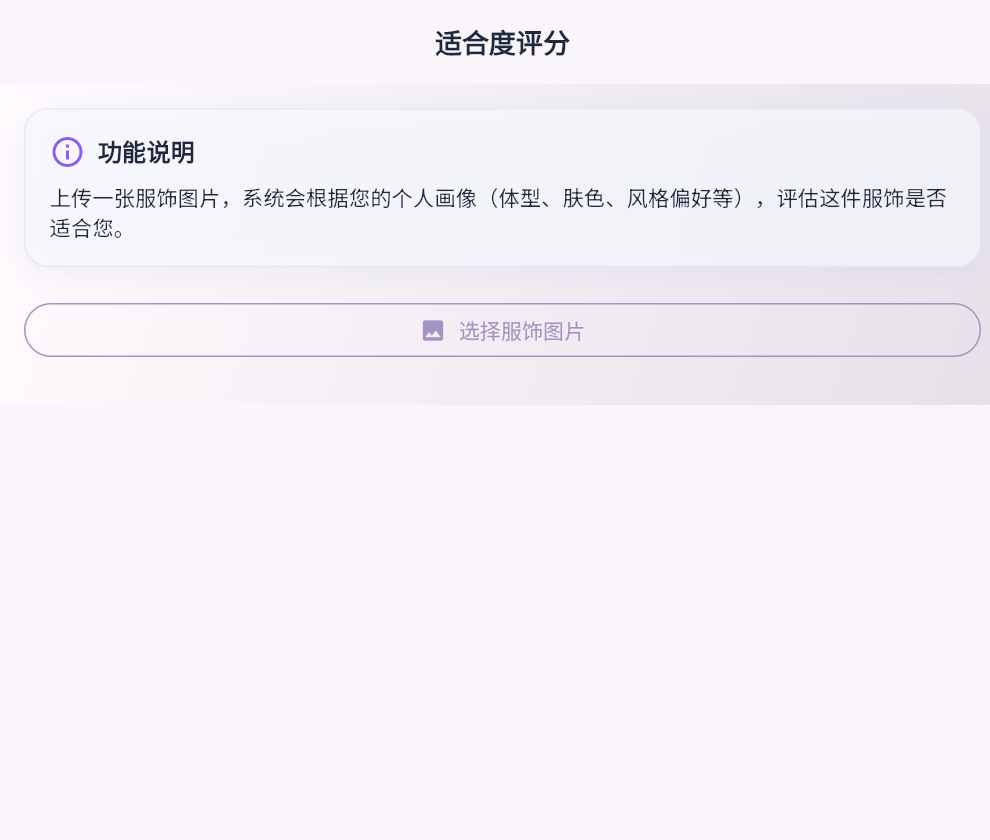

使用步骤：

1. 进入“适合度分析”。
2. 上传服饰图片，或从衣橱选择图片。
3. 点击分析。
4. 查看总分和三个维度的解释。

常见维度：

- 场景匹配：是否适合通勤、休闲、约会等场景。
- 体型友好：是否修饰或强化用户关注的身体部位。
- 风格协调：是否符合用户风格偏好。

## 12. 体型洞察

体型洞察会读取用户画像，生成更贴合体型的穿搭建议。

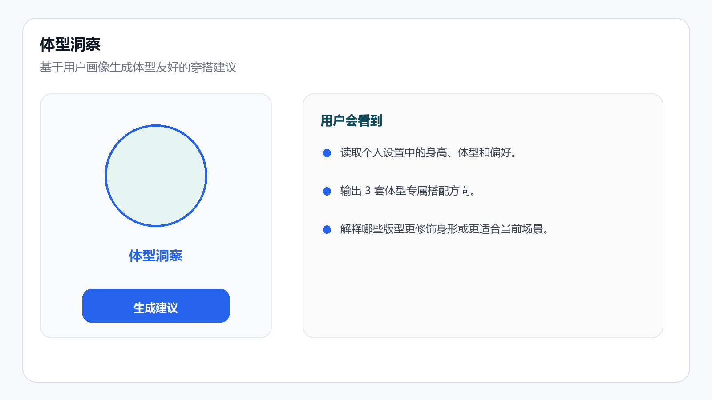

使用步骤：

1. 先在“设置”中补充身高、体型、肤色、风格偏好。
2. 从首页进入“体型洞察”。
3. 点击生成建议。
4. 查看 3 套体型专属搭配和原因说明。

适合场景：

- 用户想知道自己更适合什么版型。
- 用户想减少“好看但不适合自己”的购买。

## 13. 个人设置

个人设置用于维护用户画像和主题偏好。

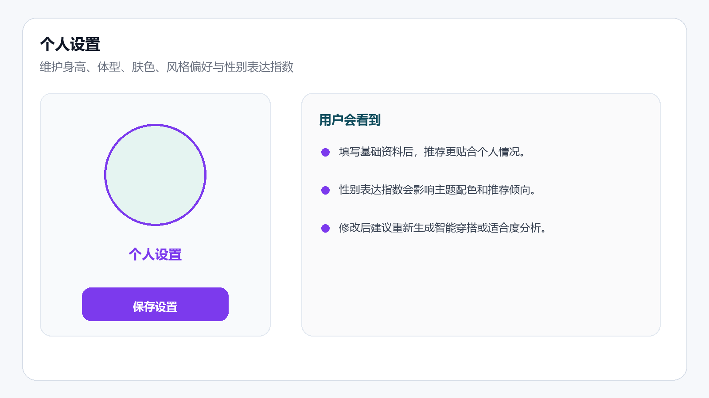

使用步骤：

1. 点击底部“设置”。
2. 补充昵称、身高、体型、肤色、风格偏好等信息。
3. 调整性别表达指数滑块。
4. 保存设置。

说明：

- 性别表达指数会影响全局主题颜色和推荐倾向。
- 用户画像越完整，适合度分析和智能穿搭越准确。

## 14. AI Agent 对话

AI Agent 用于处理更自然的穿搭请求，例如“我明天去面试，天气 20 度，帮我从衣橱里挑一套”。

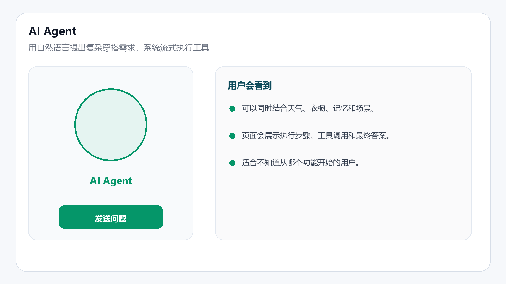

使用步骤：

1. 进入“AI Agent”或对话入口。
2. 输入自然语言需求。
3. 等待系统流式展示执行步骤。
4. 查看最终建议和调用过的工具结果。

适合场景：

- 用户不知道该点哪个功能。
- 用户想把天气、场景、衣橱和记忆一次性结合起来。
- 客服或运营需要演示多工具协同能力。

## 15. 日志和故障排查

如果运营演示或用户使用时出现问题，可按“时间点 + 功能 + 接口状态码”排查。

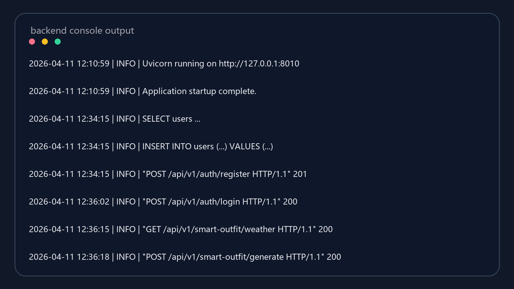

常见问题：

- 页面打不开：检查前端服务是否启动。
- 登录失败：检查后端服务、账号密码和认证接口。
- 推荐为空：检查衣橱是否已有可用衣物。
- 图片上传失败：检查图片格式、大小和网络状态。
- 虚拟试衣失败：检查衣服图是否为无模特商品图，人物图是否清晰。

## 16. 用户推荐使用路径

| 顺序 | 用户动作 | 目的 |
| --- | --- | --- |
| 1 | 注册 / 登录 | 建立账号和登录态 |
| 2 | 完成新手引导 | 了解系统能力 |
| 3 | 补充个人设置 | 提升个性化准确度 |
| 4 | 上传衣橱单品 | 建立推荐数据基础 |
| 5 | 生成智能穿搭 | 获得今天可穿的搭配 |
| 6 | 使用情绪穿搭 | 根据心情补充选择 |
| 7 | 使用适合度分析 | 判断衣服是否适合自己 |
| 8 | 使用相似度分析 | 避免重复购买 |
| 9 | 使用虚拟试衣 | 查看上身预览效果 |
| 10 | 使用 AI Agent | 处理复杂自然语言需求 |

## 17. 运营交付素材清单

| 素材 | 路径 | 用途 |
| --- | --- | --- |
| 登录页 | `docs/_tutorial_assets/login_mockup.png` | 注册、登录说明 |
| 首页 | `docs/_tutorial_assets/real_home.png` | 首页和今日推荐说明 |
| 功能总览 | `docs/_tutorial_assets/feature_map.png` | 培训和快速介绍 |
| 衣橱 | `docs/_tutorial_assets/real_shell.png` | 衣橱管理说明 |
| 智能穿搭 | `docs/_tutorial_assets/real_outfit.png` | 推荐生成说明 |
| 风格打分 | `docs/_tutorial_assets/style_score_mockup.png` | 结构化搭配评分说明 |
| 情绪穿搭 | `docs/_tutorial_assets/real_mood.jpg` | 情绪推荐说明 |
| 适合度分析 | `docs/_tutorial_assets/real_suitability.png` | 评分说明 |
| 相似度分析 | `docs/_tutorial_assets/real_similarity.png` | 重复购买预警说明 |
| 虚拟试衣 | `docs/_tutorial_assets/real_tryon.png` | 试衣流程说明 |
| 体型洞察 | `docs/_tutorial_assets/body_shape_mockup.png` | 体型友好建议说明 |
| 个人设置 | `docs/_tutorial_assets/profile_mockup.png` | 用户画像维护说明 |
| AI Agent | `docs/_tutorial_assets/agent_mockup.png` | 自然语言对话说明 |
| 日志 | `docs/_tutorial_assets/logs_mockup.png` | 运营排障说明 |
