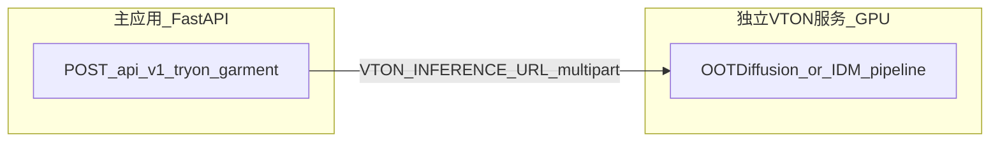

# 照片级 2D 专用试衣（VTON）集成说明

本仓库默认使用 [`backend/app/services/virtual_tryon.py`](../backend/app/services/virtual_tryon.py) 内的 **SD Inpainting + fallback**。生产环境可优先接入 **阿里云百炼（DashScope）** 的图像编辑能力（如通义万相 `wanx2.1-imageedit`），由 [`backend/app/services/bailian_tryon_client.py`](../backend/app/services/bailian_tryon_client.py) 调用；失败时可回退到 **专用 VTON 远程服务**（`VTON_INFERENCE_URL`）或本机管线。

**本轮实现摘要**（百炼、Stub 服务、Flutter 单次请求、Windows JPEG 编码修复等）见 [`VTON_DELIVERY_2026-04.md`](VTON_DELIVERY_2026-04.md)。

### CatVTON 本地深度学习引擎

除了百炼和远程服务，后端还内置了 **CatVTON 本地推理引擎**（直接调用，无需独立服务进程）：

- **引擎入口**：[`backend/app/services/tryon_v2/catvton_engine_client.py`](../backend/app/services/tryon_v2/catvton_engine_client.py) — 调用同目录的 `catvton_runner.py` 子进程（subprocess），避免 Python 依赖冲突
- **子进程脚本**：[`vton_inference_service/catvton_runner.py`](../vton_inference_service/catvton_runner.py) — 独立的 CatVTON 推理脚本，支持 MediaPipe PoseLandmarker 生成掩码（无需 SCHP / DensePose）
- **CatVTON 核心**：[`vton_inference_service/catvton_engine.py`](../vton_inference_service/catvton_engine.py) — CatVTONPipeline 封装，支持 bf16 / fp16 / fp32，自动下载 HuggingFace 权重

配置项（`backend/.env`）：
- `CATVTON_ENABLED=true` — 启用本地 CatVTON
- `CATVTON_PATH=/path/to/CatVTON` — CatVTON 仓库目录（需含 `zhengchong_CatVTON` 权重，或首次运行时自动从 HuggingFace 下载）
- `CATVTON_WIDTH=768`、`CATVTON_HEIGHT=1024`、`CATVTON_STEPS=50`、`CATVTON_GUIDANCE=2.5` — 推理参数
- `CATVTON_REPAINT=true` — 是否在生成后用原图 repaint 背景
- `CATVTON_TIMEOUT_SECONDS=2400` — 超时秒数

**极限 VRAM 优化（8GB 及以下显存推荐全部开启）：**
- `CATVTON_FORCE_FP16=true` — 强制 fp16 替代 bf16（RTX 4060 Laptop 推荐，节省约 2GB 显存）
- `CATVTON_ENABLE_VAE_SLICING=true` — VAE 分片推理（峰值显存 -40%）
- `CATVTON_ENABLE_XFORMERS=true` — xformers 高效注意力（无则自动降级到 PyTorch SDPA/FlashAttention）
- `CATVTON_LOW_VRAM_MODE=true` — **一键低显存模式**（等于 force_fp16 + vae_slicing + xformers，兼容性最好）

**白盒调试工具：**
- `--preprocess-only` 模式：仅运行前处理（mask + pose 生成），跳过扩散推理，极大加快调试速度
- `CATVTON_DEBUG_DIR=./debug_output` — 保存所有中间产物（01_input_person.jpg、03_mask.png、04_pose_keypoints.jpg、09_mask_overlay.jpg 等），每次请求生成独立文件夹
- 实时日志：子进程 stdout/stderr 通过线程流式传输到父进程终端

**快速测试脚本：**
```bash
python backend/scripts/diagnose_catvton.py          # 诊断 CatVTON 状态
python backend/scripts/test_catvton_e2e.py          # 端到端测试
cd backend && python scripts/test_catvton_direct.py # 直接测试（跳过 API 层）
```

CatVTON 在 `replace` / `realistic` / `professional` / `strict` / `balanced` / `hybrid` 六种 v2 模式中均会被尝试使用。

> **2026-05-02 更新**：v2 模式已扩展为 6 种：`strict`（默认，方案 A 几何贴合）、`balanced`（宽松 QC）、`replace`（AI 生成，引擎优先级 catvton→bailian→remote→warp→diffusion）、`realistic`（CatVTON 深度学习）、`professional`（CatVTON + 后处理）、`hybrid`（Warp 保真 + CatVTON 真实感，饱和度感知 alpha）。详见 [`backend/app/api/tryon_v2.py`](../backend/app/api/tryon_v2.py) 和 [`backend/app/services/tryon_v2/`](<../backend/app/services/tryon_v2/>)。

### 百炼（DashScope）试衣

- **开关**：`DASHSCOPE_TRYON_ENABLED=true` 且配置 `DASHSCOPE_API_KEY`（与控制台 API Key 一致）。
- **优先级**：百炼成功则直接返回；否则若 `DASHSCOPE_TRYON_FALLBACK_LOCAL=true`（默认），依次尝试 `VTON_INFERENCE_URL`、本机 `virtual_tryon`。
- **品类**：表单 `garment_category`（如 `上装`、`下装`、`裙装`）会映射到内部 bucket，并可选覆盖模型：`DASHSCOPE_TRYON_MODEL_TOP` / `_BOTTOM` / `_SKIRT`；未配置则使用 `DASHSCOPE_TRYON_MODEL`（默认 `wanx2.1-imageedit`）。
- **实现说明**：当前默认使用 `base_image_url`（人物图）+ `ref_img`（商品图）+ `function`（默认 `stylization_all`）。**并非**专用 OOTDiffusion 类 VTON，效果以百炼侧模型为准；可按控制台文档调整 `DASHSCOPE_TRYON_FUNCTION` 与模型名。
- **依赖**：`pip install dashscope`（已写入 [`backend/requirements.txt`](../backend/requirements.txt)）。

---

## OOTDiffusion vs IDM-VTON（专用模型选型）

以下信息用于 **PoC / 选型**；权重名、显存与命令行参数 **以各仓库当前 README 为准**（会随版本更新）。

| 项目 | 仓库 / 模型 | 许可证（常见） | 品类 / 分辨率要点 | 首 PoC 建议 |
|------|----------------|----------------|-------------------|-------------|
| **OOTDiffusion** | [levihsu/OOTDiffusion](https://github.com/levihsu/OOTDiffusion) · [HF](https://huggingface.co/levihsu/OOTDiffusion) | **CC BY-NC-SA 4.0**（非商业需遵守 SA 条款） | 全身管线中 `category` 常为 **0=upper / 1=lower / 2=dress**；含 **half-body**（VITON-HD）与 **full-body**（Dress Code）等变体，见官方 README。 | **默认首推**：品类枚举与主端 `上装/下装/裙装` 容易对应；社区资料多。 |
| **IDM-VTON** | [yisol/IDM-VTON](https://github.com/yisol/IDM-VTON) · [HF](https://huggingface.co/yisol/IDM-VTON) | **CC BY-NC-SA 4.0**（以仓库与 HF 页为准） | **VITON-HD** 与 **DressCode** 两套脚本（如 `inference.py` / `inference_dc.py`），DressCode 侧常用 `--category upper_body|lower_body|dresses` 等；默认分辨率多在 **768×1024** 量级，见论文/仓库说明。 | 与 OOTD 二选一或作对比；checkpoint 体积大，更适合独立盘与固定驱动环境。 |
| **CatVTON** 等 | 各作者仓库 | 以各 LICENSE 为准 | 效果与工程依赖差异大 | 在固定 **3 组黄金样张** 上与 OOTD/IDM **横向对比** 后再定。 |

**结论（与本仓库对齐）**

- 若目标是「人图 + 商品图 → 尽量同一人穿上该件」，应把 **专用 VTON（OOTDiffusion 或 IDM-VTON）部署为独立 GPU 服务**，通过下文 **`VTON_INFERENCE_URL`** 接入；主应用内 **SD Inpainting** 仅作兜底或关闭。
- **首推首 PoC 模型：OOTDiffusion**（品类标签与文档结构更利于与 `garment_category` 映射；具体映射见 [`vton_inference_service/README.md`](../vton_inference_service/README.md)）。
- **商业使用**：上述常见许可证含 **NC（非商业）**；若对外商用，需自行取得授权或使用具备商用许可的替代方案。



---

## 开源模型选型（PoC / 生产参考）

> **2026-04 已更新**：CatVTON 现已直接集成到主应用中（subprocess 调用），是当前默认推荐选项，支持 MediaPipe PoseLandmarker 自动掩码，无需 SCHP/DensePose。

| 方向 | 代表项目 | 说明 | RTX 4060 8GB 提示 |
|------|----------|------|-------------------|
| 扩散类 VTON | **CatVTON**（已集成）/ OOTDiffusion / IDM-VTON | 针对「人 + 衣」训练，单张输出 | CatVTON 推荐：`<8GB VRAM`（bf16），MediaPipe 自动掩码，无需 SCHP/DensePose |
| 传统 U-Net / warping | ACGPN、VITON-HD（偏老） | 资源占用可能更低，质感因版本而异 | 可优先做效果对比 PoC |

建议流程：**固定 2～3 组人物图 + 商品图** → 在同一 GPU 上对比延迟、显存峰值与主观观感 → 再定集成形态（进程内 vs 独立服务）。详细步骤与记录表见 [`scripts/vton_poc/POC_RUNBOOK.md`](../scripts/vton_poc/POC_RUNBOOK.md)。

## 独立推理服务（HTTP）

主应用（FastAPI）可调用独立 VTON HTTP 服务（`VTON_INFERENCE_URL`），避免与推荐/CLIP 等争显存：

- **CatVTON 模式**（由 `VTON_ENGINE=catvton` 驱动）：调用 `catvton_runner.py` subprocess，无需独立服务进程
- **HTTP 服务**（`VTON_INFERENCE_URL`）：另一进程或 Docker（`--gpus all`），仅挂载 VTON 权重与依赖
- **Stub 演示模式**：`VTON_STUB_MODE=true`，返回轻量叠图（仅用于流水线演示）

[`vton_inference_service/`](../vton_inference_service/) 目录提供完整 HTTP 服务实现，契约与主客户端兼容。

## 远程契约（主 API → VTON 服务）

主应用向 `VTON_INFERENCE_URL` 发送 **multipart/form-data**（与 [`POST /api/v1/tryon/garment`](../backend/app/api/tryon.py) 字段对齐）：

| 字段 | 说明 |
|------|------|
| `garment_file` | 衣物商品图 |
| `person_file` | 人物图 |
| `model_gender` | `male` / `female` / `neutral` |
| `garment_category` | 可选，如 `下装(汉)` |
| `prompt` | 可选；空则服务端自行构造试衣描述 |

**响应（二选一）**

1. `Content-Type: image/jpeg`（或 `image/png`）—— 主体为结果图字节。
2. `application/json`：
   ```json
   {
     "status": "success",
     "message": "ok",
     "result_image_base64": "<JPEG base64>"
   }
   ```
   `status` 可为 `success` | `fallback` | `error`；`error` 时应有 `message`。

实现见 [`backend/app/services/vton_remote_client.py`](../backend/app/services/vton_remote_client.py)。

## 本地 PoC 步骤（示例）

1. 创建独立虚拟环境，安装所选 VTON 仓库的 `requirements.txt`。
2. 按该仓库 README 下载权重（可设 `HF_ENDPOINT` 镜像）。
3. 用仓库自带脚本对样例图跑一次推理，记录 **峰值显存** 与 **单张耗时**（模板见 [`scripts/vton_poc/POC_RUNBOOK.md`](../scripts/vton_poc/POC_RUNBOOK.md)）。
4. 实现最小 HTTP 包装（或使用本仓库 [`vton_inference_service`](../vton_inference_service/) 替换 Stub 为真实推理），将 URL 写入主应用 `.env` 的 `VTON_INFERENCE_URL`（示例：`http://127.0.0.1:8011/v1/tryon`）。
5. 重启主 API，从 Flutter 虚拟试衣页走完整链路验收。

## 相关环境变量

见 [`backend/.env.example`](../backend/.env.example)：`VTON_INFERENCE_URL`、`VTON_INFERENCE_TIMEOUT_SECONDS`、`VTON_INFERENCE_API_KEY`（可选）。

## 部署拓扑示例（Docker）

见 [`deploy/vton/docker-compose.vton-example.yml`](../deploy/vton/docker-compose.vton-example.yml)（仅示例，VTON 镜像需自行构建并挂载 GPU）。
